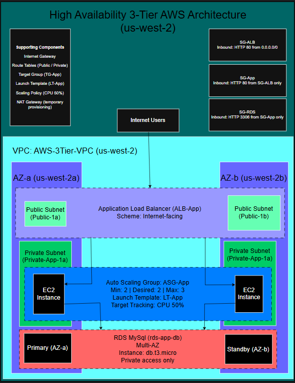

# AWS High Availability 3-Tier Architecture (HA)

A highly available 3-tier AWS architecture deployed in **us-west-2** demonstrating networking fundamentals, load balancing, auto scaling, and database security best practices. The environment uses public/private subnet isolation across two Availability Zones, an internet-facing Application Load Balancer, a private Auto Scaling Group, and a Multi-AZ RDS MySQL database in private subnets.

## Architecture

**Flow**
- User / Internet  
  → **ALB** (public subnets across 2 AZs)  
  → **EC2 App Tier** (private subnets, Auto Scaling Group)  
  → **RDS MySQL** (private subnets, Multi-AZ)

**Security segmentation**
- **SG-ALB** allows inbound **HTTP :80** from the internet
- **SG-App** allows inbound **HTTP :80** only from **SG-ALB**
- **SG-RDS** allows inbound **MySQL :3306** only from **SG-App**

**Diagram**
- 

## AWS Resources (as deployed)

**Region:** us-west-2

### Networking
- **VPC:** AWS-3Tier-VPC
- **Public subnets:** 2 AZs (for ALB)
- **Private subnets:** 2 AZs (for EC2 + RDS)
- **Internet Gateway** for public routing
- **Temporary NAT Gateway** used for private instance provisioning (managed for cost)

### Load Balancing
- **ALB:** ALB-App (internet-facing)
- **Target Group:** TG-App
- **Listener:** HTTP :80

### Compute (App Tier)
- **Launch Template:** LT-App
- **Auto Scaling Group:** ASG-App
  - **Min / Desired / Max:** 2 / 2 / 3
- **Scaling:** Target tracking policy (**CPU 50%**)

### Database (Data Tier)
- **RDS MySQL:** rds-app-db
- **Instance class:** db.t3.micro
- **Multi-AZ:** enabled
- **Public access:** disabled
- **Subnet group:** private subnets only

## Validation (end-to-end proof)

Connectivity was validated by confirming database access with SQL commands such as:
- `SHOW DATABASES;`
- `SELECT NOW();`

Notes:
- Validation evidence is in `screenshots/`
- Additional notes: `examples/validation-notes.md`

## Screenshots (evidence)

All screenshots live in `screenshots/`:

- `01-vpc-overview.png`
- `02-subnets.png`
- `03-route-tables.png`
- `04-internet-gateway.png`
- `06-alb.png`
- `07-target-group-health.png`
- `08-launch-template.png`
- `09-auto-scaling-group.png`
- `10-scaling-policy.png`
- `11-rds-config.png`
- `12-security-groups.png`
- `13-sql-validation.png`

## Teardown / Cost Control

See: `teardown.md`